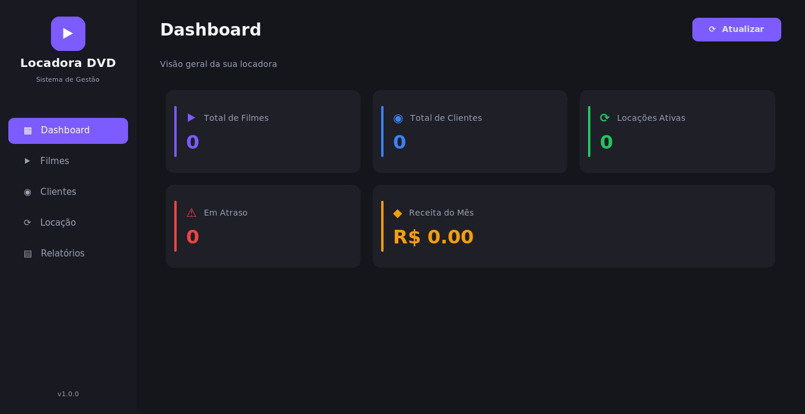
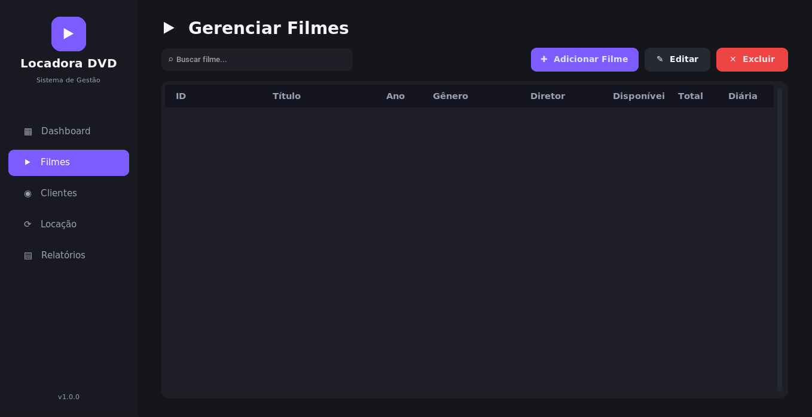

# ⯈ Locadora de DVDs - Sistema de Gestão

Este é um sistema desktop moderno de gestão para locadora de DVDs desenvolvido em **Python**, utilizando a biblioteca **CustomTkinter** para a interface gráfica e o banco de dados **SQLite** para persistência dos dados. O software possui um visual elegante (com tema escuro ativo por padrão), controle transacional robusto, validação de regras de negócio de locação e relatórios estatísticos dinâmicos.

---

## 📸 Demonstração da Interface

Abaixo estão apresentadas as principais telas do sistema, ilustrando o fluxo de trabalho completo da locadora:

### 1. Dashboard Principal
A tela inicial fornece uma visão consolidada do estado atual da locadora, exibindo métricas-chave e a receita financeira acumulada no mês atual.


### 2. Gerenciamento de Filmes
Permite cadastrar, pesquisar, editar e excluir títulos. Controla informações como diretor, gênero, sinopse, preço da diária, multa por atraso, quantidade total em estoque e quantidade disponível no momento.


### 3. Gerenciamento de Clientes
Uma interface limpa para gerenciar o cadastro de clientes, incluindo validações básicas e campos para Nome, CPF, Telefone, E-mail e Endereço.


### 4. Controle de Locações (Nova Locação)
Permite realizar o empréstimo de filmes selecionando dinamicamente títulos disponíveis e clientes cadastrados. O sistema calcula a data esperada de devolução com base nos dias estipulados de locação.


### 5. Relatórios & Estatísticas
Aba com relatórios interativos para auxiliar na tomada de decisão, listando:
* Filmes mais locados.
* Melhores clientes.
* Locações em atraso (com cálculo dinâmico de dias de atraso e valor total acumulado).
* Histórico completo de locações ativas e concluídas.


---

## 🛠️ Arquitetura do Projeto

O projeto segue uma estrutura organizada e modular:

```text
locadora_dvd/
├── main.py                # Ponto de entrada do sistema
├── database/              # Conexão e modelos do banco de dados
│   ├── connection.py      # Inicialização do SQLite e gerenciamento de transações
│   └── models.py          # CRUD de filmes, clientes e locações
├── components/            # Componentes visuais personalizados
│   ├── sidebar.py         # Barra de navegação lateral
│   └── table.py           # Tabela personalizada para exibição de dados
├── views/                 # Telas (frames) do sistema
│   ├── dashboard.py       # Tela de indicadores gerais
│   ├── movies_view.py     # Tela de gerenciamento de filmes
│   ├── customers_view.py  # Tela de gerenciamento de clientes
│   ├── rentals_view.py    # Tela de empréstimo e devolução
│   └── reports_view.py    # Tela de estatísticas e históricos
├── utils/                 # Ferramentas auxiliares e estilização
│   ├── theme.py           # Sistema de design (paletas, fontes e ícones)
│   └── helpers.py         # Formatadores de datas e moedas
├── imagens/               # Capturas de tela e assets visuais
└── dist/                  # Diretório com o executável empacotado
```

---

## ⚡ Principais Funcionalidades & Pontos Relevantes

1. **Persistência de Dados & Concorrência Segura**: 
   * Configuração do SQLite no modo **WAL (Write-Ahead Logging)** no arquivo [connection.py](file:///home/eduardo/Modelos/Programação/locadora_dvd/database/connection.py#L14), permitindo leituras e escritas concorrentes sem travamentos.
   * Utilização de um gerenciador de contexto (`@contextmanager`) no método [db](file:///home/eduardo/Modelos/Programação/locadora_dvd/database/connection.py#L20-L35) que realiza commits automáticos e rollback automático em caso de exceções, evitando conexões vazadas.
2. **Regras de Negócio de Locação**:
   * Controle de estoque: a quantidade disponível do filme é decrementada automaticamente ao realizar uma locação e incrementada ao receber uma devolução ([models.py](file:///home/eduardo/Modelos/Programação/locadora_dvd/database/models.py#L231-L252)).
   * Cálculo de multas: no momento da devolução, o sistema compara a data atual com a data limite esperada. Havendo atraso, é gerada uma multa diária acumulada com base na configuração do filme.
3. **Design System Moderno**:
   * O arquivo [theme.py](file:///home/eduardo/Modelos/Programação/locadora_dvd/utils/theme.py) centraliza as constantes visuais (cores secundárias, destaques em Indigo/Violeta, fontes e glifos Unicode).
   * Suporte nativo a Light/Dark Mode gerenciado pelo CustomTkinter.

---

## 🚀 Como Executar o Projeto

### Opção 1: Executar a partir do Código Fonte (Desenvolvimento)

#### Pré-requisitos
* Python 3.10 ou superior instalado.

#### Passo a Passo

1. **Clonar ou acessar a pasta do projeto**:
   ```bash
   cd /home/eduardo/Modelos/Programação/locadora_dvd
   ```

2. **Ativar o ambiente virtual**:
   ```bash
   source venv/bin/activate
   ```

3. **Instalar as dependências**:
   ```bash
   pip install customtkinter pillow pyinstaller
   ```

4. **Executar a aplicação**:
   ```bash
   python main.py
   ```

---

### Opção 2: Executar o Binário Empacotado (Deploy / Produção)

O projeto foi empacotado utilizando **PyInstaller** em um único executável standalone contendo todos os recursos necessários (código, banco de dados inicial e assets do CustomTkinter).

#### Detalhes do Build
* **Tipo**: Um único arquivo executável (`--onefile`).
* **Interface**: Sem console de terminal em segundo plano (`--windowed`).
* **Ícone**: Configurado com o ícone oficial [logo.ico](file:///home/eduardo/Modelos/Programação/locadora_dvd/logo.ico).
* **Banco de dados integrado**: O banco SQLite inicial está contido no executável. Na primeira execução, ele é copiado automaticamente para o diretório do executável, garantindo que as alterações (cadastros e locações) sejam gravadas permanentemente de forma persistente.

#### Como Executar o Executável
Basta abrir o terminal e rodar o binário gerado na pasta `dist`:
```bash
./dist/locadora_dvd
```
*(Certifique-se de dar permissão de execução caso necessário com `chmod +x dist/locadora_dvd`)*.
